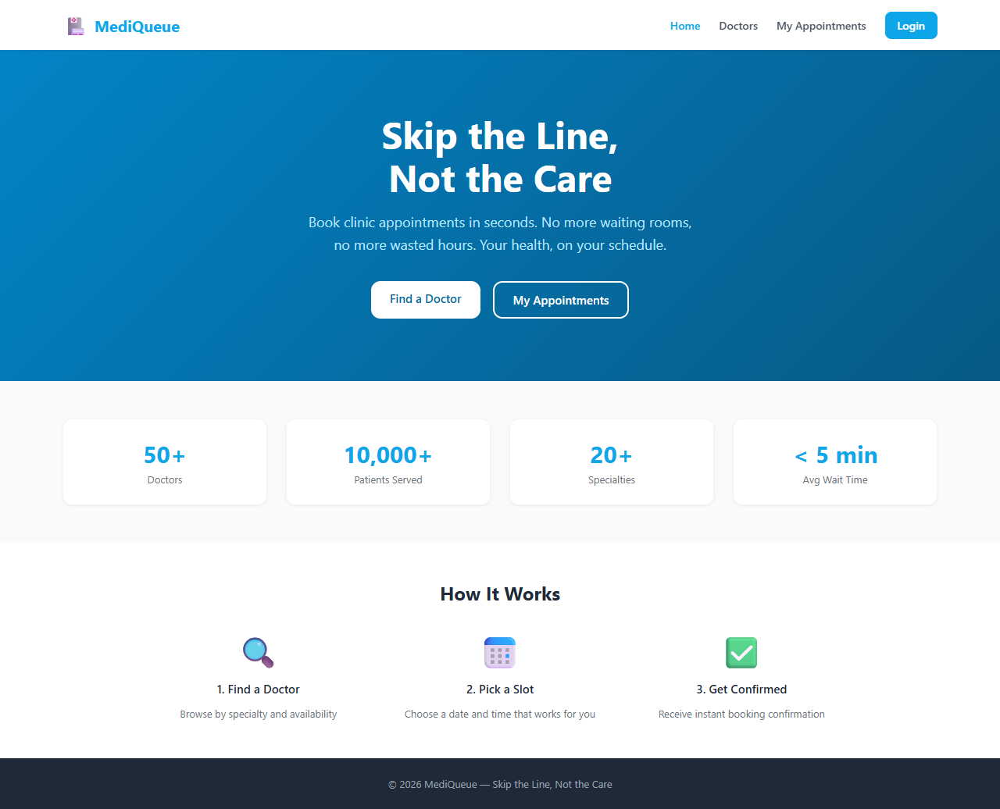
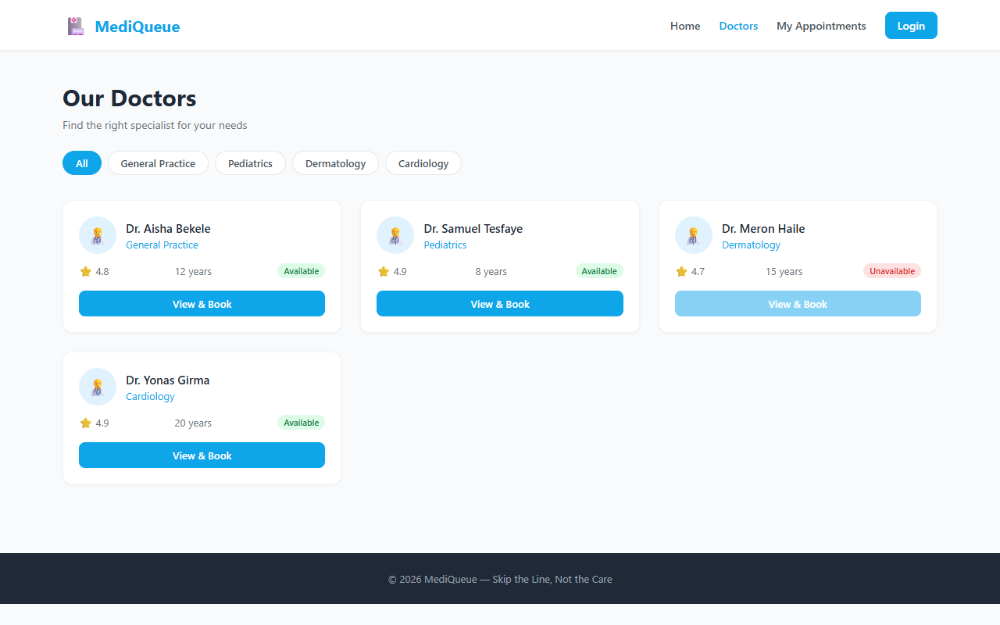
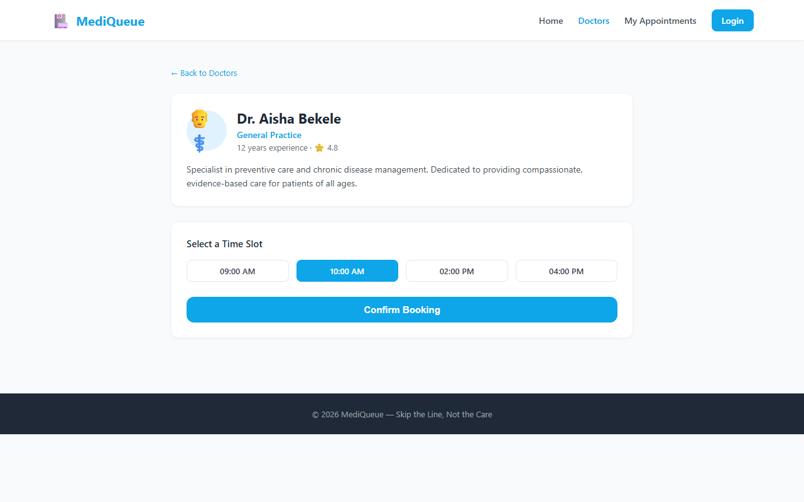
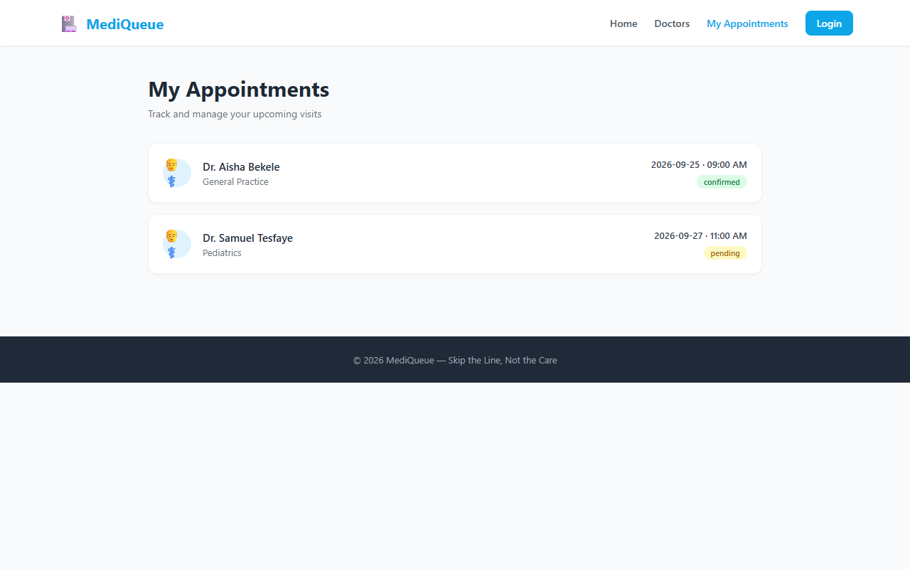
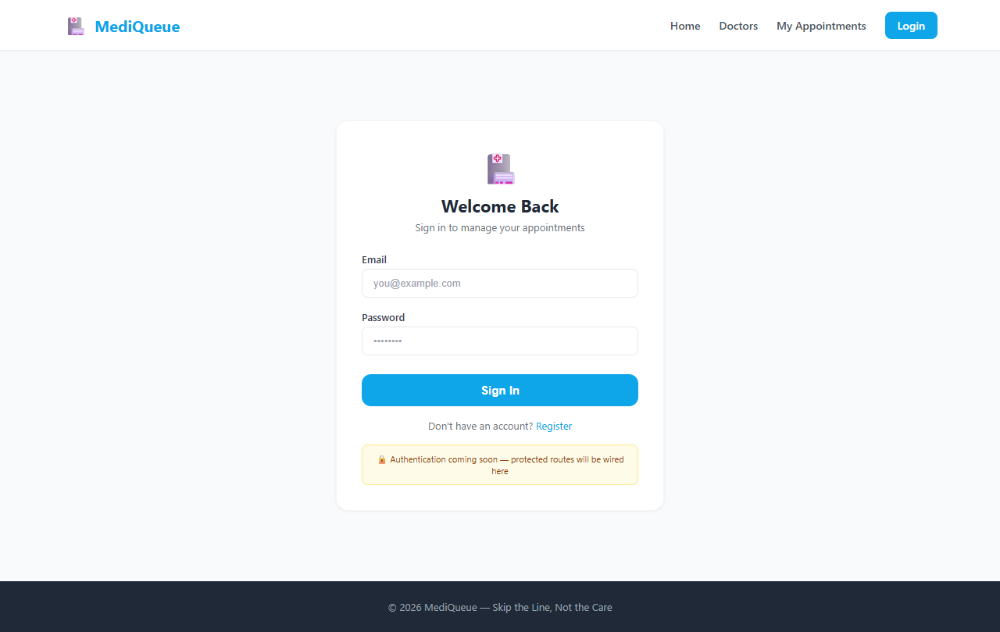

# 🏥 MediQueue

> **Skip the Line, Not the Care**


---

## 📋 Table of Contents

- [Problem Statement](#-problem-statement)
- [Solution](#-solution)
- [Features](#-features)
- [Screenshots](#-screenshots)
- [Tech Stack](#-tech-stack)
- [Project Structure](#-project-structure)
- [Route Map](#-route-map)
- [Getting Started](#-getting-started)
- [Docker](#-docker)
- [Environment Variables](#-environment-variables)
- [Git Workflow](#-git-workflow)
- [Roadmap](#-roadmap)
- [License](#-license)

---

## 🚨 Problem Statement

In Ethiopia and many developing countries, patients waste **hours standing in clinic queues** with no way to:
- Know how long the wait will be
- Book a slot in advance
- See which doctors are available

Clinics, on the other hand, have **no digital record** of appointments and struggle to manage patient flow efficiently.

---

## 💡 Solution

**MediQueue** is a clinic appointment booking web app that lets patients:
- Browse doctors by specialty
- View real-time availability
- Book a time slot in seconds
- Track and manage their appointments — all without leaving home

---

## ✨ Features

| Feature | Status |
|---|---|
| Browse doctors by specialty | ✅ Done |
| Filter doctors by availability | ✅ Done |
| Doctor profile + time slot booking | ✅ Done |
| Instant booking confirmation | ✅ Done |
| My appointments list | ✅ Done |
| Appointment detail + cancel / rebook | ✅ Done |
| Login page scaffold | ✅ Done |
| Auth-protected routes | 🔜 Sprint 2 |
| Real API integration | 🔜 Sprint 3 |
| Admin / clinic dashboard | 🔜 Sprint 4 |

---

## 📸 Screenshots

> _Add screenshots here after first run_

| Home | Doctors | Doctor Detail |
|---|---|---|
|  |  |  |

| Appointments | Login |
|---|---|
|  |  |

---

## 🛠 Tech Stack

| Layer | Technology |
|---|---|
| UI Library | React 19 |
| Build Tool | Vite 8 |
| Routing | React Router v7 |
| Styling | Tailwind CSS v3 |
| Container | Docker (multi-stage) |
| Web Server | Nginx (Alpine) |
| Package Manager | npm |

---

## 📁 Project Structure

```
medi-queue/
├── public/                   # Static assets (favicon, etc.)
├── src/
│   ├── components/
│   │   ├── Layout.jsx        # Root layout: Navbar + <Outlet> + Footer
│   │   ├── Navbar.jsx        # Sticky top nav with active link highlighting
│   │   ├── Footer.jsx        # Site footer
│   │   └── DoctorCard.jsx    # Reusable doctor card used on /doctors
│   ├── pages/
│   │   ├── Home.jsx              # /          — Hero, stats, how-it-works
│   │   ├── Doctors.jsx           # /doctors   — List + specialty filter
│   │   ├── DoctorDetail.jsx      # /doctors/:id — Profile + slot booking
│   │   ├── Appointments.jsx      # /appointments — My appointments list
│   │   ├── AppointmentDetail.jsx # /appointments/:id — Detail + actions
│   │   ├── Login.jsx             # /login     — Auth scaffold
│   │   └── NotFound.jsx          # *          — 404 page
│   ├── data/
│   │   └── mockData.js       # Seed data: doctors[] + appointments[]
│   ├── App.jsx               # BrowserRouter + all Route definitions
│   ├── main.jsx              # ReactDOM.createRoot entry point
│   └── index.css             # Tailwind @tailwind directives
├── .dockerignore
├── .env.example              # Environment variable template
├── .gitignore
├── docker-compose.yml        # prod + dev profiles
├── Dockerfile                # Multi-stage: builder → nginx:alpine
├── Dockerfile.dev            # Dev server with hot reload
├── index.html                # Vite HTML entry
├── nginx.conf                # SPA fallback + gzip + cache headers
├── package.json
├── postcss.config.js
├── tailwind.config.js
└── vite.config.js
```

---

## 🗺 Route Map

| Route | Page | Dynamic | Auth Required |
|---|---|---|---|
| `/` | Home | — | No |
| `/doctors` | Doctors list | — | No |
| `/doctors/:id` | Doctor detail + booking | `:id` = doctor ID | No |
| `/appointments` | My appointments | — | 🔒 Sprint 2 |
| `/appointments/:id` | Appointment detail | `:id` = appointment ID | 🔒 Sprint 2 |
| `/login` | Login | — | No |
| `*` | 404 Not Found | — | No |

---

## 🚀 Getting Started

### Prerequisites

- [Node.js](https://nodejs.org/) v20+
- [Docker](https://www.docker.com/) (optional, for containerised runs)

### Local Development

```bash
# 1. Clone the repo
git clone https://github.com/<your-username>/medi-queue.git
cd medi-queue

# 2. Copy environment variables
cp .env.example .env

# 3. Install dependencies
npm install

# 4. Start the dev server
npm run dev
```

Open [http://localhost:5173](http://localhost:5173) in your browser.

### Available Scripts

| Command | Description |
|---|---|
| `npm run dev` | Start Vite dev server with HMR |
| `npm run build` | Build optimised production bundle |
| `npm run preview` | Preview the production build locally |

---

## 🐳 Docker

### Development — hot reload on port 5173

```bash
docker compose --profile dev up --build
```

Open [http://localhost:5173](http://localhost:5173)

### Production — Nginx on port 3000

```bash
docker compose up --build
```

Open [http://localhost:3000](http://localhost:3000)

### Stop containers

```bash
docker compose down
```

### How the multi-stage build works

```
Dockerfile
├── Stage 1 — builder  (node:20-alpine)
│   ├── npm ci          ← installs exact locked deps
│   └── npm run build   ← outputs /app/dist
└── Stage 2 — production (nginx:alpine)
    ├── COPY dist → /usr/share/nginx/html
    └── nginx.conf      ← SPA fallback + gzip + 1-year asset cache
```

The final image contains **zero Node.js** — only Nginx + static files. This keeps the image small and secure.

---

## 🔐 Environment Variables

Copy `.env.example` to `.env` before running locally:

```bash
cp .env.example .env
```

| Variable | Description | Default |
|---|---|---|
| `VITE_APP_TITLE` | Browser tab title | `MediQueue` |
| `VITE_API_BASE_URL` | Backend API base URL (future) | `http://localhost:4000/api` |

> All Vite env variables must be prefixed with `VITE_` to be exposed to the browser.

---

## 🌿 Git Workflow

### Branch naming

```
main          ← stable, always deployable
dev           ← integration branch
feature/xxx   ← new features  e.g. feature/doctor-filter
fix/xxx       ← bug fixes     e.g. fix/booking-slot-reset
chore/xxx     ← tooling/config e.g. chore/update-deps
```

### Commit message convention (Conventional Commits)

```
<type>(<scope>): <short description>

feat(doctors):    add specialty filter
fix(booking):     reset selected slot on doctor change
chore(docker):    pin node image to 20.18-alpine
docs(readme):     add screenshots section
style(navbar):    fix active link colour on mobile
refactor(layout): extract Footer into its own component
```

### Typical workflow

```bash
git checkout dev
git pull origin dev
git checkout -b feature/my-feature

# ... make changes, commit often ...
git add .
git commit -m "feat(scope): what you did"

git push origin feature/my-feature
# open a Pull Request → dev
```

---

## 📅 Roadmap

### Sprint 1 — Scaffold ✅
- [x] Project brief + route map
- [x] Vite + React + Tailwind setup
- [x] Docker (dev + prod)
- [x] All 6 routes reachable
- [x] Mock data

### Sprint 2 — Auth & State
- [ ] React Context for auth state
- [ ] Protected routes (`/appointments`, `/appointments/:id`)
- [ ] Login / logout flow

### Sprint 3 — Real API
- [ ] Connect to REST API
- [ ] `useEffect` + loading / error states
- [ ] Optimistic UI for booking

### Sprint 4 — Polish
- [ ] Responsive mobile nav
- [ ] Toast notifications
- [ ] Skeleton loaders

---

## 📄 License

This project is licensed under the [MIT License](LICENSE).

---

<p align="center">Built with ❤️ as part of the IBT Module 3 Capstone — React & Next.js 2026</p>
